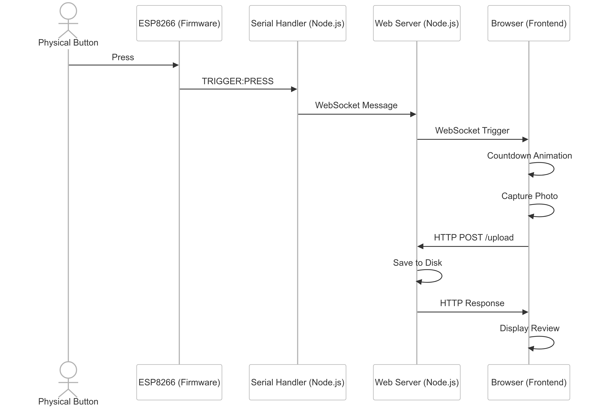

# Crappy Snap (v3, AI generated) 📸 📸

A modern, web-based photo booth application that combines browser-based camera capture with hardware integration for a responsive photo booth experience. This version (v3) was entirely designed and implemented by the Cursor AI agent, showcasing the capabilities of AI-assisted development.


## Overview

The system architecture combines a web interface, WebSocket communication, and hardware integration to create a seamless photo capture system with session-based photo access.

```
System Architecture:

┌─────────────────┐         ┌─────────────────┐         ┌─────────────────┐
│   Web Browser   │◄────────│   Web Server    │◄────────│ Serial Handler  │
│   (Frontend)    │         │    (Node.js)    │         │    (Node.js)    │
└────────┬────────┘         └────────┬────────┘         └────────┬────────┘
         │                           │                           │
         │                           │                           │
         │         WebSocket         │         Serial            │
         │                           │        Protocol           │
         │                           │                           │
┌────────┴────────┐          ┌───────┴─────────┐         ┌───────┴─────────┐
│  Media Capture  │          │   File System   │         │    ESP8266      │
│   (getUserMedia)│          │   (Photo Store) │         │    (Firmware)   │
└─────────────────┘          └─────────────────┘         └─────────────────┘
                                    │                              │
                                    │                              │
                             ┌──────┴──────┐                ┌──────┴──────┐
                             │  Session    │                │  Physical   │
                             │  Management │                │  Button     │
                             └──────┬──────┘                └─────────────┘
                                    │
                             ┌──────┴──────┐
                             │  QR Code    │
                             │  Gallery    │
                             └─────────────┘
```

### Sequence Diagram



## Original Requirements

1. Basic photo booth functionality with live preview
2. Physical button trigger support
3. High-resolution photo capture (2K)
4. Flash effect
5. Review period for captured photos
6. Debug overlay with camera statistics
7. Support for multiple cameras
8. Fullscreen mode
9. Responsive design

## New Features

10. Session-based photo access
11. QR code generation for easy mobile access
12. Secure gallery access with JWT authentication
13. Responsive gallery page with lightbox view
14. Session timeout after 2 minutes of inactivity

## Original Prompt

> I am creating a  party photo booth application where users will:
> 
> * see a live preview of the camera view on screen
> * be able to tap "capture" on the screen
> * when capture is tapped, a high resolution photo is taken and saved
> * the photo is then shown to the user for a short period (2-5 seconds)
> * then return to live preview.
>
> The camera will be connected to the browser via USB using Webcam (UVC) protocol. 
>
> Create me a new prototype for this web application that will;
>
> * Show the live video stream on screen 
> * Show a button that a user can click to capture the photo
> * Save the photo to disk

## Limitations Compared to Original crappy-snap

This implementation differs from the [original crappy-snap project](https://github.com/nickw444/crappy-snap/tree/v2) in several important ways:

**Camera Integration & Image Quality**:
- Original: Uses gphoto2 to trigger a DSLR camera, capturing full-resolution photos (RAW/high-quality JPEGs) directly from the camera's sensor to SD card
- Current: Limited to the webcam/UVC stream resolution (usually 1080p) with quality loss from multiple compression steps

**Control & Dependencies**:
- Original: Full access to camera settings (aperture, shutter speed, etc.) but requires gphoto2 and compatible DSLR
- Current: Limited camera control but works with any UVC-compatible webcam or DSLR in webcam mode

Despite these limitations, this implementation offers advantages in simplicity, broader device compatibility, and easier setup without requiring specialized camera control libraries.

**Note on Quality**: For a party photo booth where the primary goal is capturing fun moments rather than professional-quality photography, the resolution and quality provided by this implementation (up to 2K) is more than sufficient. These photos are intended to capture the spirit and enjoyment of the event, not serve as high-resolution keepsakes. The immediacy and reliability of the system outweigh the benefits of marginally higher image quality.

## Key Features

- **Live Preview**: Full-screen camera preview with support for multiple cameras
- **High Resolution**: Captures photos at up to 2K resolution
- **Hardware Integration**: ESP8266-based button interface via serial connection
- **Review Mode**: Configurable review period with progress indicator
- **Debug Overlay**: Real-time camera statistics and settings
- **Multiple Triggers**: Support for:
  - Physical button (short press)
  - Physical button (long hold)
  - Space bar
  - On-screen button
- **Responsive Design**: Scales appropriately for different screen sizes
- **Visual Feedback**: Flash effect and large countdown display
- **Session Management**: Groups photos into sessions with 2-minute timeout
- **QR Code Access**: Generates QR codes for easy mobile access to photos
- **Secure Gallery**: JWT-authenticated access to session photos
- **Mobile-Friendly Gallery**: Responsive design with swipe gestures and lightbox

## Technical Implementation

### Frontend (Browser)
- Pure JavaScript with no external dependencies
- Media Capture and Streams API for camera access
- WebSocket for real-time communication
- CSS animations for visual effects
- Responsive design using viewport units
- Touch-friendly gallery with swipe gestures

### Backend (Node.js)
- Express.js for web server
- WebSocket for real-time communication
- Serial port handling for ESP8266 integration
- File system management for photo storage
- JWT for secure gallery access
- QR code generation for mobile access
- Session management with timeout

### Hardware Interface (ESP8266)
- Simple serial protocol
- Debounced button handling
- Support for both short and long press
- Auto-reconnection capability

## Setup and Usage

1. Install dependencies:
```bash
npm install
```

2. Flash the ESP8266:
- Upload `button_handler.ino` to your ESP8266
- Connect button between GPIO4 (ESP8266 pin 2) and GND

3. Start the server:
```bash
npm start
```

4. Start the serial handler:
```bash
npm run serial
```

5. Access the photo booth:
```
http://localhost:3000
```

## Controls

- `Space`: Take photo
- `F`: Toggle fullscreen
- `D`: Toggle debug overlay
- Physical button: Take photo
- Physical button (hold): Alternative trigger (not yet used)

## Configuration

Debug overlay (`D` key) provides access to:
- Camera selection
- Review time adjustment
- Button visibility toggle
- Real-time statistics

## Session-Based Photo Access

The application now features a session-based photo access system:

1. **Session Creation**: A new session is created when:
   - The application starts
   - After 2 minutes of inactivity
   - When the first photo is taken

2. **QR Code Display**: 
   - A QR code is displayed during the review period
   - The QR code remains visible until the session times out
   - The QR code is clickable for desktop testing

3. **Gallery Access**:
   - Scanning the QR code opens a mobile-friendly gallery
   - Photos are grouped by session
   - Gallery access is secured with JWT authentication
   - The gallery link remains valid for 7 days

4. **Session Timeout**:
   - Sessions expire after 2 minutes of inactivity
   - When a session expires, the QR code is hidden
   - A new session is created when the next photo is taken

## Technical Notes

- Uses internal pull-up resistor on ESP8266
- WebSocket ensures low-latency triggers
- Handles camera disconnection gracefully
- Supports hot-plugging of ESP8266
- Persists settings in localStorage
- Automatically reconnects to selected camera
- JWT tokens expire after 7 days
- QR codes use error correction level M
- Session IDs are generated using UUID v4
- Photos are named with session ID and sequence number

## Future Enhancements

Potential improvements identified:
1. Multiple button support
2. LED feedback
3. Sound effects
4. Social sharing
5. Print integration
6. Custom overlays
7. Email delivery of photos
8. Custom branding options
9. Photo filters and effects
10. Admin interface for session management

## Security Setup

### Required Environment Variables

For security reasons, the application requires certain environment variables to be set:

1. **JWT_SECRET** (Required): A strong, random string used for signing JWT tokens.
   ```bash
   # Set in your environment before running the application
   export JWT_SECRET=your-secure-random-string
   ```

> **IMPORTANT**: The application will refuse to start if the JWT_SECRET environment variable is not set.

### Optional Environment Variables

The application also supports the following optional environment variables:

1. **BASE_URL**: The base URL for the gallery links and QR codes. Defaults to 'http://localhost:3000'.
   ```bash
   # Example: Set the base URL for production
   export BASE_URL=https://booth.example.com
   ```

2. **PORT**: The port on which the server will listen. Defaults to 3000.
   ```bash
   # Example: Run the server on port 8080
   export PORT=8080
   ```

## Project Structure

The project is organized as follows:

- `server/` - Contains all server-side JavaScript components:
  - `server.js` - Main Express server and WebSocket implementation
  - `session-manager.js` - Handles session creation and management
  - `qr-generator.js` - Generates QR codes for gallery access
  - `serial-handler.js` - Handles communication with hardware via serial port
  - `trigger.js` - Simple utility to trigger photo capture programmatically
- `public/` - Static web assets (HTML, CSS, client-side JavaScript)
- `uploads/` - Directory where captured photos are stored
- `docs/` - Documentation assets
- `button_handler.ino` - Arduino firmware for ESP8266 hardware button 